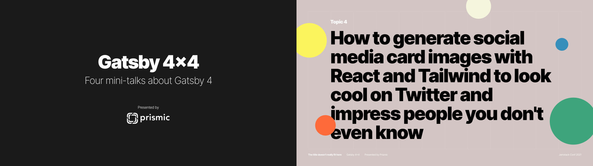

# Gatsby 4×4 - Open Graph image demo

This repository contains a few examples of how Gatsby can be used to generate [Open Graph][og] images using [React][react] and [Tailwind][tailwind].

When you share a link on social media platforms that support Open Graph, like Twitter, an image can be displayed alongside the page's title and description. Gatsby can automatically generate these images for you using your own React template.

This repository is a companion to one of four talks shown during [Prismic][prismic]'s **Gatsby 4×4** presentation at [Jamstack Conf 2021][jamstackconf].



## How to try this yourself

1. **Create a GitHub personal access token** ([see instructions](https://docs.github.com/en/authentication/keeping-your-account-and-data-secure/creating-a-personal-access-token))

   The demo uses the GitHub API to generate repository pages.

2. **Deploy to Netlify**

   [](https://app.netlify.com/start/deploy?repository=https://github.com/prismicio-community/gatsby-og-image-demo)

   This will create a site on Netlify and clone the repository to your own GitHub account. You will be asked for your GitHub personal access token to set as an environment variable.

3. **Update your `siteUrl` in `gatsby-node.js`**

   Once your Netlify site is generated, edit your GitHub repository's `gatsby-node.js` to include your own Netlify URL. This URL will be used for the Open Graph image URL.

   You can make this change directly on GitHub using the edit button.

## Edit the demo

If you want to make changes to the demo, clone your new repository to your machine and edit the code.

1. Clone your repository.
2. Start the Gatsby development server.

   ```sh
   npm run develop
   ```

3. Edit the templates. Each file includes a short description of its purpose.
4. When you want to deploy your changes, commit your code. Netlify will rebuild your site once you push.

Have fun generating your own Open Graph images! 😊

## License

```
Copyright 2013-2021 Prismic <contact@prismic.io> (https://prismic.io)

Licensed under the Apache License, Version 2.0 (the "License");
you may not use this file except in compliance with the License.
You may obtain a copy of the License at

    http://www.apache.org/licenses/LICENSE-2.0

Unless required by applicable law or agreed to in writing, software
distributed under the License is distributed on an "AS IS" BASIS,
WITHOUT WARRANTIES OR CONDITIONS OF ANY KIND, either express or implied.
See the License for the specific language governing permissions and
limitations under the License.
```

<!-- Links -->

[prismic]: https://prismic.io
[og]: https://ogp.me/
[jamstackconf]: https://jamstackconf.com/
[react]: https://reactjs.org/
[tailwind]: https://tailwindcss.com/
